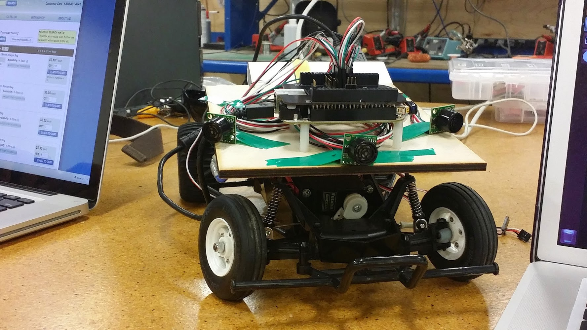

# JIMINY - The Autonomous Tamiya Grasshopper

## Overview
Jiminy is a platform to test machine learning algorithms learned in the 
Coursera machine learning course. The PCB will allow hookups to ultrasonic
sensors, an electronic speed controller(esc), and 3 servos. The servos/esc 
will all have a programmable passthrough mode that will allow the RC car
to be driven with an RC transmitter as normal. When in pass through mode,
the pulse widths from the receive going to the esc/servos will be readable.
When not in pass through mode, the esc/servo lines can be driven from the 
beaglebone.


## Getting Started

### Device Overlay Setup
Before running the code you need to set up the GPIO pin muxes appropriately
and enable the PRU. To do that run the following command as root:
```
./setup.sh
```

### Building and Running
To build and run the code:
```
make
./jiminy.elf
```

Here's a snapshot of Jiminy in his development phase. In the future I would like 
to 3D print a custom body to house the sensors and electronics to clean him up.


